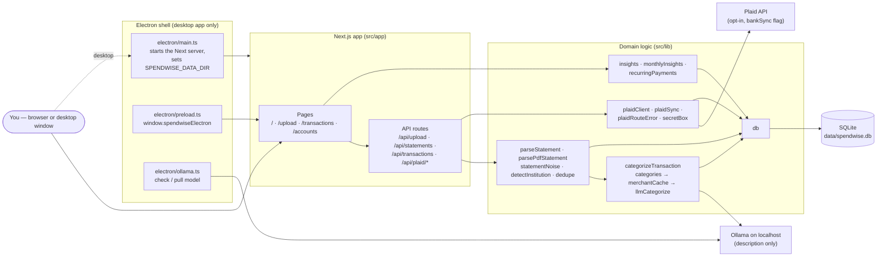

# SpendWise — Architecture (big picture)

> Start here when you don't know which file to touch. Kept current by
> `tests/docs.test.ts` (DOC-1): every `src/lib` module, API route, page,
> component, Electron file, and script must be named in this file, and every
> database table and column in [database-schema.md](database-schema.md). Update
> both in the same PR as the change.

SpendWise is a local-first personal finance app: one Next.js 16 app (UI + API
routes) over one SQLite file, optionally wrapped in Electron as a desktop app.
Nothing leaves the machine by default — the only outbound paths are the local
LLM on `localhost` and the opt-in Plaid bank connection (`bankSync` flag).

## The whole system

## Request paths

| Path | Flow |
|---|---|
| **Upload a statement** | `UploadForm` → `POST /api/upload` → `parseStatement.ts` (CSV, with the bank/card account type) or `parsePdfStatement.ts` (PDF) → `statementNoise.ts` drops balance/total lines → `detectInstitution.ts` fills the institution unless you typed one → `dedupe.ts` hash skips rows already stored → `categorizeTransaction.ts` per row → `statements` + `transactions` rows |
| **Categorize a transaction** | `categories.ts` keyword rules → `merchantCache.ts` (`merchant_categories` table) → `llmCategorize.ts` (Ollama on `localhost`, sends the description only) → result saved to the merchant cache |
| **Open the dashboard** | `/` (server component) → `insights.ts`, `monthlyInsights.ts`, `recurringPayments.ts` read `transactions` directly → chart components |
| **Correct a category** | `/transactions` → `PATCH /api/transactions` → sets `category_locked = 1` |
| **Manage statements** | `StatementsList` → `GET` / `PATCH` (institution) / `DELETE` `/api/statements`; delete cascades to transactions and revokes a Plaid item via `plaidSync.ts` |
| **Connect a bank (Plaid)** | `PlaidConnectButton` → `POST /api/plaid/link-token` → Plaid Link → `POST /api/plaid/exchange` → access token encrypted by `secretBox.ts` → `plaid_items` row → `POST /api/plaid/sync/[itemId]` runs `plaidSync.ts` (added/modified/removed changesets); `GET /api/plaid/items` lists connections. Errors go through `plaidRouteError.ts`, which never logs raw Plaid errors. See [plaid-bank-sync.md](plaid-bank-sync.md) |
| **Desktop start** | `electron/main.ts` points `SPENDWISE_DATA_DIR` at the OS user-data folder, starts the bundled Next server, and opens a window; `electron/ollama.ts` checks for Ollama and the model, surfaced by `OllamaSetupBanner`. See [packaging.md](packaging.md) |

## Modules — `src/lib`

| Module | Responsibility |
|---|---|
| `db.ts` | Opens the SQLite file (WAL), creates tables, runs additive migrations — see [database-schema.md](database-schema.md) |
| `parseStatement.ts` | CSV parsing: header detection, dates, amounts, bank vs card sign convention (BUG-1/16) |
| `parsePdfStatement.ts` | PDF text extraction and line heuristics; detects card statements and flips signs |
| `statementNoise.ts` | Recognizes balance/summary lines so parsers drop them |
| `detectInstitution.ts` | Best-effort bank/issuer name from statement text |
| `dedupe.ts` | `transactionHash` — skips re-inserting the same transaction |
| `categories.ts` | The fixed category list and ordered keyword rules |
| `categorizeTransaction.ts` | Layered categorization: keywords → merchant cache → local LLM |
| `merchantCache.ts` | Merchant key normalization and the learned `merchant_categories` lookup |
| `llmCategorize.ts` | Ollama call on `localhost`; description only (NFR-2) |
| `insights.ts` | Dashboard totals, category/month breakdowns, suggestions |
| `monthlyInsights.ts` | Per-institution monthly breakdown, month explorer, top days, day-of-week patterns |
| `recurringPayments.ts` | Detects subscriptions/bills by cadence and flags due-soon/missed |
| `plaidClient.ts` | Configured Plaid client (sandbox by default) |
| `plaidSync.ts` | Applies Plaid sync changesets; revokes access when a Plaid statement is deleted |
| `plaidRouteError.ts` | Safe error responses and log summaries for Plaid routes (BUG-15) |
| `secretBox.ts` | AES-256-GCM encryption of Plaid access tokens at rest |
| `repairCardCsvImport.ts` | One-off data repair for card CSVs imported before the BUG-1/16 fix |
| `featureFlags.ts` | `isFeatureEnabled` — off-switches for large or risky features |
| `logger.ts` | `logInfo` / `logWarn` server logging (use instead of `console.*`) |

## API routes — `src/app/api`

| Route | Methods | Purpose |
|---|---|---|
| `api/upload` | POST | Import a CSV/PDF statement |
| `api/statements` | GET, PATCH, DELETE | List statements, edit institution, delete (cascades) |
| `api/transactions` | GET, PATCH | List transactions, correct a category |
| `api/plaid/link-token` | POST | Start Plaid Link |
| `api/plaid/exchange` | POST | Exchange the public token; store the encrypted access token |
| `api/plaid/items` | GET | List connected banks |
| `api/plaid/sync/[itemId]` | POST | Sync one connected bank |

## Pages and components — `src/app`, `src/components`

| Page | File | Components |
|---|---|---|
| Layout (every page) | `layout.tsx` | `Nav`, `OllamaSetupBanner` |
| Dashboard `/` | `page.tsx` | `StatTile`, `CategoryBarChart`, `MonthlyTrendChart`, `MonthlyInstitutionChart`, `MonthExplorer`, `TopSpendingDays`, `DayOfWeekChart`, `RecurringPayments`, `SuggestionsList` |
| Upload `/upload` | `upload/page.tsx` | `UploadForm`, `StatementsList` |
| Transactions `/transactions` | `transactions/page.tsx` | (inline table with category editing) |
| Accounts `/accounts` | `accounts/page.tsx` | `AccountsPageContent`, `ConnectedAccountsList`, `PlaidConnectButton` |

Shared by charts: `LabeledBarChart` (bar chart building block) and `chartColors`
(stable per-institution colors).

## Desktop and scripts

| File | Purpose |
|---|---|
| `electron/main.ts` | Electron entry: data directory, bundled Next server, window |
| `electron/preload.ts` | Exposes `window.spendwiseElectron` (Electron-only UI) |
| `electron/ollama.ts` | Ollama status check, download page, model pull with progress |
| `scripts/electron-prepare.mjs` | Cross-platform copy step for packaging |
| `scripts/repair-bug1-card-csv.ts` | Runs the BUG-1/16 repair (dry run unless `--apply`) |

## Where to change what

| To… | Change |
|---|---|
| Support a new bank's statements | Follow `.claude/skills/add-bank/SKILL.md` (`detectInstitution.ts`, parser tests) |
| Fix a mis-categorized merchant | `categories.ts` keyword rules (+ a test in `tests/lib/categories.test.ts`) |
| Change CSV/PDF parsing | `parseStatement.ts` / `parsePdfStatement.ts` + fixtures in `tests/fixtures/` |
| Add a dashboard insight | `insights.ts` or `monthlyInsights.ts` + a component + `src/app/page.tsx` |
| Change what's stored | `db.ts` (additive migration) + [database-schema.md](database-schema.md) |
| Add a risky/large feature | a flag in `featureFlags.ts` ([workflow.md](workflow.md)) |
| Change packaging/release | [packaging.md](packaging.md), `.claude/skills/cut-release/SKILL.md` |

Every change also updates the matching requirement in
[specs/requirements.md](../specs/requirements.md).
