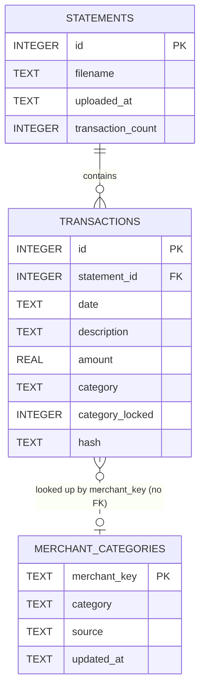

# Database schema

SpendWise stores everything in a single local SQLite file at `data/spendwise.db`
(created on first run, gitignored — see [db.ts](../src/lib/db.ts)). WAL mode is
enabled for crash-safe concurrent reads/writes. There is no external database —
this file is the entire data layer.

## Entity-relationship diagram

## Tables

### `statements`

One row per file uploaded (CSV or PDF). Deleting a statement cascades to delete
its transactions (`ON DELETE CASCADE`) — this is the only delete path in the app;
uploads never delete or modify existing rows.

| Column              | Type    | Notes                                                        |
| ------------------- | ------- | ------------------------------------------------------------- |
| `id`                 | INTEGER | Primary key, autoincrement                                    |
| `filename`           | TEXT    | Original uploaded filename, as-is                              |
| `uploaded_at`        | TEXT    | `datetime('now')` at insert time (UTC)                        |
| `transaction_count`  | INTEGER | Count of *newly inserted* transactions from this upload (excludes duplicates skipped from this same file) |

### `transactions`

The core table. Every page and every dashboard query reads from here directly —
there is no per-statement scoping anywhere except the optional `statement_id`
foreign key itself; the Dashboard and Transactions views always aggregate across
every statement.

| Column             | Type    | Notes                                                                 |
| ------------------ | ------- | ---------------------------------------------------------------------- |
| `id`                | INTEGER | Primary key, autoincrement                                             |
| `statement_id`      | INTEGER | FK → `statements.id`, `ON DELETE CASCADE`                              |
| `date`              | TEXT    | ISO `yyyy-mm-dd` when parseable, else the raw parsed string            |
| `description`       | TEXT    | Raw merchant/description text as extracted from the statement          |
| `amount`            | REAL    | Signed: positive = money in, negative = money out (see sign-convention note below) |
| `category`          | TEXT    | One of the fixed categories in [categories.ts](../src/lib/categories.ts) |
| `category_locked`   | INTEGER | `1` once a human has manually corrected the category via the Transactions page; currently informational only (nothing reads it back yet) |
| `hash`              | TEXT    | `sha256(date \| lowercased-trimmed description \| amount.toFixed(2))` — see [dedupe.ts](../src/lib/dedupe.ts). Used to skip re-inserting the same transaction on a repeat/overlapping upload. Indexed, not unique-constrained (checked in application code, not the schema) |

Indexes: `date`, `category`, `statement_id`, `hash`.

**Sign convention**: for a checking-account-style CSV, positive = deposit,
negative = withdrawal, matching the source file. For a PDF detected as a credit
card statement (see [parsePdfStatement.ts](../src/lib/parsePdfStatement.ts)), the
convention is inverted at parse time so it's consistent everywhere else: a charge
is negative (an expense), and a payment/credit is positive and categorized as
`Transfers` — never treated as income.

### `merchant_categories`

A small learned lookup table, independent of any single statement or transaction
— it's a standing merchant → category memory, not a foreign-keyed relation. Rows
are consulted by [categorizeTransaction.ts](../src/lib/categorizeTransaction.ts)
as the second step in the categorization pipeline (after keyword rules, before
the local LLM), so a merchant is never classified twice.

| Column         | Type | Notes                                                                    |
| -------------- | ---- | -------------------------------------------------------------------------- |
| `merchant_key`  | TEXT | Primary key — a normalized merchant signature (lowercased, punctuation stripped, long digit runs like reference/store numbers removed); see `getMerchantKey()` in [merchantCache.ts](../src/lib/merchantCache.ts) |
| `category`      | TEXT | The learned category for this merchant                                    |
| `source`        | TEXT | `"llm"` (written after a local-LLM classification) or `"user"` (written after a manual correction on the Transactions page) |
| `updated_at`    | TEXT | `datetime('now')` of the last write                                       |

**Write precedence**: a `user` correction always overwrites a prior `llm` guess
for that merchant, but a fresh `llm` guess never overwrites an existing `user`
correction — enforced by a conditional `ON CONFLICT` clause in
`saveMerchantCategory()`, not by application-level branching. This is what makes
a manual fix on the Transactions page permanent for that merchant across all
future imports.

## Categorization pipeline (how `category` gets set)

Every transaction is categorized once, at upload time, by
[`categorizeTransaction()`](../src/lib/categorizeTransaction.ts), which tries
each layer in order and stops at the first hit:

1. **Keyword rules** ([categories.ts](../src/lib/categories.ts)) — instant, free, human-curated substring matching.
2. **Merchant cache** (`merchant_categories`) — instant, a merchant already resolved by the LLM or a prior user correction.
3. **Local LLM** (Ollama, see [llmCategorize.ts](../src/lib/llmCategorize.ts)) — a few hundred ms, only reached if the first two miss. Its result is written back into the merchant cache with `source = "llm"`.
4. **Amount-sign fallback** — `Income` for a positive amount, `Other` otherwise, if nothing above applies (e.g. Ollama isn't running).

A manual correction via `PATCH /api/transactions` updates the transaction row
directly and writes `merchant_categories` with `source = "user"`, so the next
import of that merchant skips straight to step 2 instead of re-guessing.

## Migrations

There is no migration framework — [`db.ts`](../src/lib/db.ts) runs
`CREATE TABLE IF NOT EXISTS` for every table on every connection open, plus one
hand-written, idempotent migration (`migrateHashColumn`) that adds the `hash`
column and backfills it for databases created before duplicate detection
existed. Any future schema change should follow the same pattern: an additive,
idempotent function checked via `PRAGMA table_info`, called from `createDb()`.
